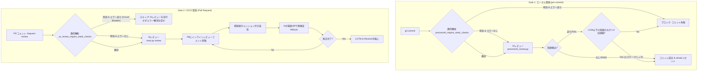
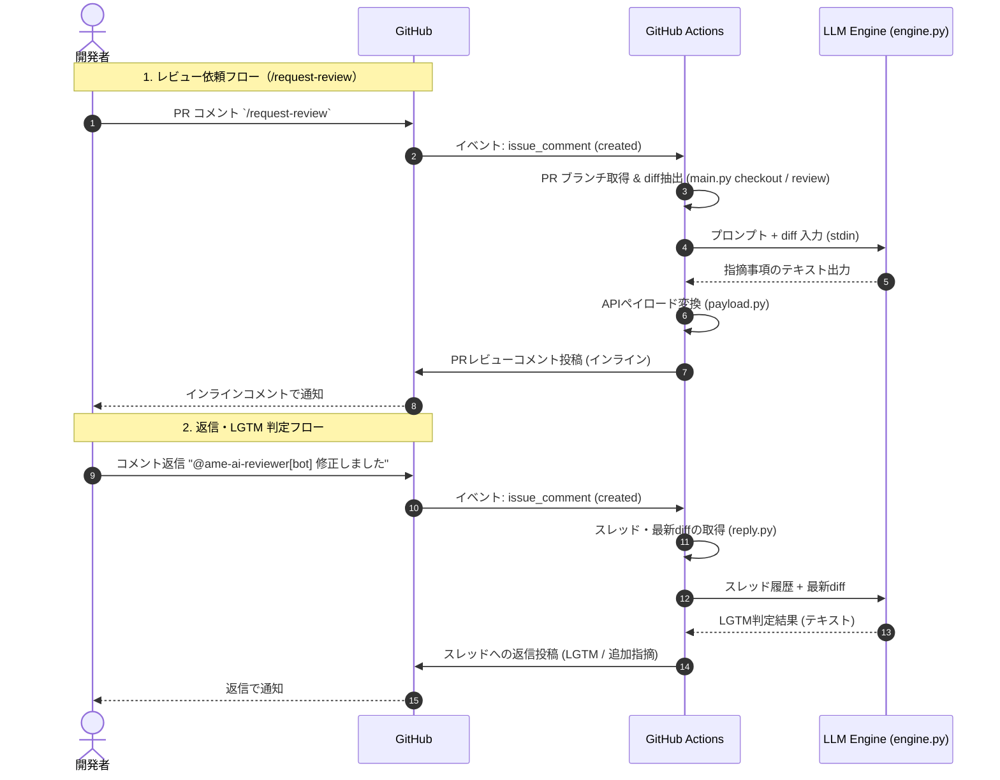

# アーキテクチャ解説

本システムは、ローカル（Gate 1: pre-commit）と CI/CD（Gate 2:
PR）の二重のゲートウェイから構成されています。軽量で拡張性の高いアーキテクチャを採用しており、各LLMツール（Claude
Code / OpenCode / Antigravity CLI）と接続する `engine.py` を通じて実行されます。

## システムの核心的特徴と設計思想

本システムは以下の4つのコアバリューに基づいて設計されています。

1. **ベースブランチとの全累積差分レビュー (`origin/<base>...HEAD`)**
   - コミット単位の差分評価のみでは、複数コミットを含む PR における変更の全容や整合性の把握が困難である。本システムでは
     `git diff origin/{base_ref}...HEAD` （`main.py`
     内で抽出）により全累積差分を網羅的に抽出し、PR 全体の変更意図を一貫して評価する。
2. **厳格なデフォルト静的解析 (Static Circuit Breaker)**
   - 機械的な問題は静的解析（tsc / eslint / mypy / ruff /
     semgrep 等の約25ツール）により高い精度で捕捉する。エラー時はAIレビューを自動スキップしコスト削減とフィードバックを両立する。
3. **二重ゲート（Gate 1 / Gate 2）アーキテクチャ**
   - ローカルコミット時（Gate 1）と CI/CD PR時（Gate
     2）の二段階で品質を検証する。欠陥をローカルで早期検知（Shift-Left）しつつCIで確実なガードを展開する。
4. **Codingエージェント連携 & 広範なコンテキスト検証**
   - LLMエンジンとして Claude Code / OpenCode / Antigravity
     CLI 等を指定可能。全リポジトリを参照し「コード修正に伴うドキュメント（Documents）も更新されているか」などの整合性チェックを柔軟に実現する。

---

## 二重ゲート（Dual-Gate）アーキテクチャの構成

前段に高速な「静的解析」、後段に「AIレビュー」を配し、APIコスト削減と高い品質維持を両立しています。

<!-- NOTE: subgraph は角括弧+クォート形式 subgraph id ["label"] を使用する。
     ベアクォート形式 (subgraph id "label") は Mermaid パーサーが受け付けない。 -->



## 各ゲートにおける処理の流れ

### Gate 1: ローカル開発（pre-commit ゲート）

開発者がローカル環境で `git commit` を実行した際にトリガーされます。

1. **静的解析**: `ruff`/`mypy`/`semgrep`
   で検証する（設定有効時のみ）。エラー検出時は即座にブロックする。
2. **AIレビュー**: すべての静的解析をパスした場合、`precommit_review.py`
   を呼び出す。PRレビューと同一のプロンプトを用い、staged ファイルおよびブランチ差分をレビューする。
3. **コミット可否判定**: AIの指摘に `CRITICAL`, `HIGH`, `MIDDLE`
   などのブロック対象（LOW/INFO 以外）が含まれる場合、コミットをブロックする。
4. **エスケープハッチ**: `LOW`
   レベル以下の指摘のみが 2 回連続した（streakが2に達した）場合、無限ループ回避のためコミットを許可（PASS）する。コミット成功時には
   `post-commit` フックにより streak を 0 にリセットする。

### Gate 2: CI/CD 環境（PR ゲート）

PR作成時またはPRコメントでのコマンド入力によって動作します。主に以下の2つのトリガーで動作し、CI環境での Circuit
Breaker 機構を備えています。

- **`/request-review` コマンドによるレビュー依頼**
- **指摘スレッドへの開発者からの返信**



> すべての指摘スレッドが Resolve されたら、再度 `/request-review`
> を入力して再レビューを依頼します。指摘がゼロになるまでこのサイクルを繰り返します。

---

## 各構成ファイルの役割

### 1. エントリポイント（Python モジュール）

本システムのシェルスクリプトは廃止され、すべて `ame_ai_review_system/`
パッケージの Python サブコマンドとして統合されています。`python3 -m ame_ai_review_system.main <subcommand>`
形式で起動します。

- **`main.py`** CLI エントリポイント。以下のサブコマンドを提供する。
  - `review` — PR レビュー本体。Git から差分 (diff) を抽出し、`review_prompt.txt` の内容と結合して
    `engine.py` 経由で LLM エンジンを呼び出す。出力された指摘を `payload.py` に渡し、GitHub
    API 経由でインラインレビューコメントを投稿する。`/request-review`
    トリガー（`review_command.yml`）から呼ばれる。
  - `checkout` — PR コメント経由のトリガーで対象 PR のブランチを作業ツリーへ取り込み、`BASE_REF`
    や PR メタデータを後続ステップへ渡す共通ヘルパ。`review_command.yml` / `review_reply.yml`
    で利用する。
  - `setup` — 開発環境セットアップ補助。
- **`reply.py`** 開発者からの返信コメントを検知して起動（`reply run`
  サブコマンド）。GitHub の PR コメントスレッドを走査し、AI宛てメンションでAIが未返信のスレッドを特定する。また、会話履歴と最新の Git
  diff から、Claude 用の返信判定プロンプトを生成し、`engine.py` 経由で LGTM か追加指摘かを判断する。
- **`precommit_review.py`** pre-commit フック本体。 `git commit`
  実行時にステージ済み差分 + ブランチ差分 (`origin/<base>...HEAD`) を `review_prompt.txt` と結合して
  `engine.py`
  に渡す。PR レビューと同じプロンプトを再用。出力をパースし、指摘 0 件なら PASS、LOW/INFO 以外の severity（CRITICAL/HIGH/MIDDLE 等）を含めば FAIL、LOW/INFO のみの場合は streak カウンタを進めて 2 回連続で PASS とする（無限ループ回避）。エンジン失敗時は fail-closed でブロック。streak はブランチ単位で
  `~/.config/ame-ai-review-system/precommit_state_<hash>.json` に保存される。
- **`precommit_engine.py`**
  pre-commit レビュー専用のエンジン解決モジュール。PR レビューと異なり、開発端末で動く pre-commit では「現在実装に使っている AI ツール」を親プロセスから自動検出する (`precommit_engine="auto"`)。例えば OpenCode で実装しているなら、使用したモデルに応じて同じ組合せでレビューする。解決順: 環境変数
  `PRECOMMIT_REVIEW_*` > `config.user.json` / `config.json` の `precommit_*` > 自動検出 > PR 設定。
- **`post_commit_reset.py`** post-commit フック。コミット成功時に `precommit_review.py`
  が管理する streak カウンタを 0 にリセットする。
- **`precommit_state.py`** pre-commit レビューの状態管理モジュール。 `precommit_review.py` /
  `post_commit_reset.py` 両方から利用される。

### 2. 設定・ビジネスロジック（Pythonスクリプト）

- **`engine.py`** LLM エンジンアダプタ。プロンプトを stdin で受け取り、設定に応じて `claude` /
  `opencode run` / `agy`
  のいずれかを起動し、モデルのテキスト応答を stdout へ出力する。各エンジンごとの出力形式の違いはここで吸収し、呼び出し側はエンジンの種類を意識しなくてよい。
- **`review_config.py`** `config.json` / `config.user.json` の読み込みと `/request-review`
  コマンドを判定するヘルパ。 `get <key>` で設定値を、`is-review-command <body>`
  でコマンド判定結果を出力する。設定の優先順位は `config.user.json` >
  `config.json` > 組み込みデフォルト。
- **`payload.py`** モデル出力テキストをパースし、GitHub API 用のインラインコメント（`line` /
  `side: "RIGHT"`
  を含む）のペイロードへ変換する。AI 出力の実ファイル行番号を diff 内の有効行へスナップする検証も行う。
- **`static_precheck.py`** PR レビュー前段の静的解析 pre-check（Circuit
  Breaker）。ruff/mypy/semgrep を実行し、エラーが1件でもあれば AI レビューをスキップする。
- **`diff_utils.py`** git
  diff のメタデータ・バイナリ差分・連続空行を除去する diff 圧縮ユーティリティ。
- **`pr_streak.py`** PR レビューの streak 管理。2回連続で LOW 指摘のみの場合に完了扱いとする。

---

## LLM エンジン (engine.py) の動作原理

本システムでは、API を直接叩くコードを書く代わりに、`engine.py`
が各エンジンの CLI をサブプロセス起動する。呼び出し側は `main.py` / `reply.py`
経由で起動し、エンジンの種類を意識しなくてよい。エンジン・モデル・思考量・予算は `config.json` /
`config.user.json` または環境変数で指定する。

解決順序: 環境変数 > `config.user.json` > `config.json` > デフォルト。

### 対応エンジンと思考量のマッピング

| エンジン        | CLI バイナリ   | 思考量 (high/medium/low) の渡し方              |
| --------------- | -------------- | ---------------------------------------------- |
| `claude` (既定) | `claude -p`    | `--effort high\|medium\|low`                   |
| `opencode`      | `opencode run` | `--variant high\|medium\|minimal`              |
| `antigravity`   | `agy`          | モデル名の括弧 `"<model> (High\|Medium\|Low)"` |

**切り替え時の注意**: モデル名の名前空間はエンジンごとに異なる。`claude` は `config.json` の
`model`（既定 `sonnet`）を使用する。`opencode` / `antigravity` では Claude 専用名を渡さず、環境変数
`REVIEW_MODEL` でエンジン固有のモデル名を指定する。 `opencode` は `REVIEW_MODEL` 未設定時、`-m`
を省略して OpenCode 既定値を使う。 `antigravity` は思考量をモデル名に埋め込むため `REVIEW_MODEL`
が必須（例: `Gemini 3.5 Pro`）。

**出力形式**: 各エンジンの生出力は `engine.py` がプレーンテキストへ正規化する。

- `claude`: `--output-format text`
- `opencode`: `--format json`（NDJSON の `{"type":"text"}` イベントを結合）
- `antigravity`: `agy --print` の生テキスト

フラグ名はバージョンにより異なりうるため、切替時に `--help` で確認すること。

**検証済み CLI バージョン**:

- OpenCode `1.18.3`: `opencode run --format json`
- Antigravity CLI `agy 1.0.16`: `agy --print "<prompt>" --model "<model> (High)"`

バージョン違いではフラグ・構文に差異が生じうる。導入時に各 CLI の `--help` で確認すること。

### 設定例（`config.json`）

```json
{
  "engine": "claude",
  "model": "sonnet",
  "thinking": "high",
  "review_budget_usd": 2.0,
  "reply_budget_usd": 0.2
}
```

### ユーザー固有設定（`config.user.json`）

`config.user.json`（Git 管理対象外・存在しない場合は無視される）で `config.json`
の値を上書きできます。環境変数 `AME_REVIEW_USER_CONFIG` でパスを変更可能です。

```json
{
  "precommit_engine": "claude",
  "precommit_model": "sonnet",
  "precommit_thinking": "medium"
}
```

環境変数でワークフローや Secrets から上書きできます。

| 環境変数                 | 内容                                                                    |
| ------------------------ | ----------------------------------------------------------------------- |
| `REVIEW_ENGINE`          | `claude` / `opencode` / `antigravity`                                   |
| `REVIEW_MODEL`           | エンジン固有のモデル名（後方互換: `CLAUDE_MODEL` も可）                 |
| `REVIEW_THINKING`        | `high` / `medium` / `low`                                               |
| `REVIEW_BUDGET_USD`      | クラウド予算。Claude の `--max-budget-usd` のみ効果あり。               |
| `REPLY_BUDGET_USD`       | 返信ロール専用の予算。未設定時は `REVIEW_BUDGET_USD` にフォールバック。 |
| `REVIEW_TIMEOUT_SECONDS` | エンジン実行のタイムアウト（既定 600 秒）。                             |

### なぜ CLI 呼び出しを採用しているか？

1. **設定が極めてシンプル**: ランナー上で各 CLI の認証が通っていれば、API クライアントライブラリやトークン管理が不要になる。
2. **モデル設定が容易**: 設定ファイルや環境変数でエンジン・モデル・思考量を切り替えられる。
3. **依存ゼロ**: `engine.py` は標準ライブラリのみで動作し、新規パッケージ依存を増やさない。
